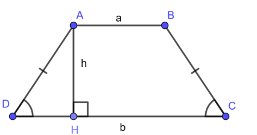

# Luyện tập

### Bài 1:
- Xuất bảng cửu chương từ 1 đến 10 .
```php
for(int i=1;i<10;i++){
//code 
}
```
### Bài 2:
- input(đầu vào): nhập a và b , kiểu dữ liệu (int) 
<!--  output(đầu ra): xuất ra tất cả các bảng cửu chương từ a đến b
ví dụ - input 4, 6
      - output xuất bảng cửu chương 4 ,5,6 -->

 ```php
 for(){// sử dụng 2 vòng lặp for
     for(){

     }
 }
```
### Bài 3:
###### Cho hình sau :


****
- input : nhập vào độ dài cạnh AB,DC,AD và góc D
- output: Tính diện tính hình bình hành ABCD = ?

### link gửi đáp án file .java or .txt  : ["Tại đây "](https://driveuploader.com/upload/1ibdhFSxCm) 


