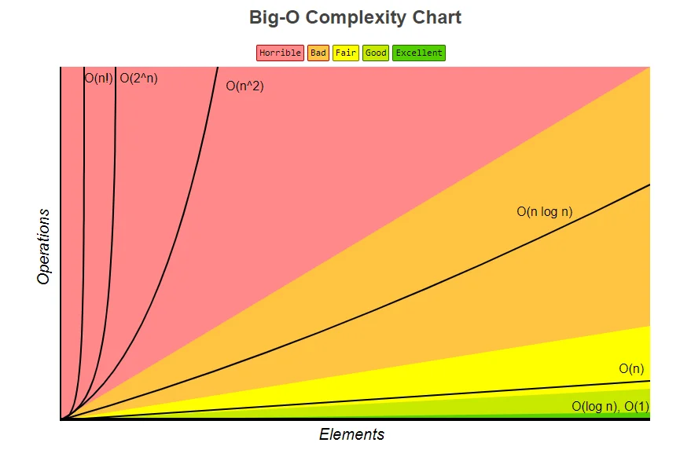

# Search

1. ## Giới thiệu độ phức tạp của thuật toán
  - Độ phức tạp của thuật toán là thời gian để máy tính có thể chạy và xử lý thuật toán đó
  - Đại lượng : chữ o in hoa (O)
  - Các độ phức tạp của thuật toán :
    - **O(1)**
    > Code ví dụ :
    ```Java
    int s,n=10;
    s=n*(n-1) /2;
    ```
    > Thuật toán trên sẽ tính được giá trị của biến (varriable) s và thực hiện 1 phép tính n(n-1)/2 
    
    . Độ phức tạp sẽ phụ thuộc vào số phép tính mà chương trình thực hiện nhiều nhất . Ở đây là 

    1 phép tính hay còn viết là O(1).

    - **O(n)**
    > Code ví dụ
    ```Java
    Scanner sc=new Scanner(System.in);
    int n=Integer.parseInt(sc.nextInt());
    int sum=0;
    
    for(int i=0;i<n;i++){
        sum=sum+i;//tính tổng từ 1->n 
    }
    ```
    > Thuật toán trên sẽ thực hiện n phép tính( n do người dùng nhập). Có thể người dùng sẽ nhập là 
    
    1 thì độ phức tạp sẽ là O(1) , nhưng bình thường thì chúng ta không xét trường hợp tốt nhất là 
    
    người dùng sẽ nhập 1, chúng ta chỉ xét trường hợp _xấu nhất_ khi tìm độ phức tạp . Đó là O(n).

    - **O(n^2)**
    > Code ví dụ

    ```Java
    public static void printArray(int[]array){
        for(int x:array){
           System.out.println(x);
        }
    }
    public static void main(String[] args) {
    Random rand=new Random();
    int array[]=new int [100];
    for(int i=0;i<100;i++){
       array[i]=rand.nextInt(100);
    }

    for (int i=0;i<100;i++){
        for(int j=0;j<100;j++){
         if(array[i]<array[j]){
             int temp=array[i];
             array[i] = array[j];
             array[j] = temp;

         }
        }
    }
    printArray(array);
}
```
> Thuật toán trên là Bubble Sort có độ phức tạp là O(n^2). Để ý kỹ ở phần 2 vòng lặp for lồng nhau 

chúng ta sẽ thấy 2 biến là i và j . Khi vòng lặp bắt đầu chạy thì i=0 và j =0 .Tiếp theo vòng lặp sẽ 

chạy và i vẫn bằng 0 và j=1 . cho đến khi j=100 thì i=1. Để kiểm chứng điều đó. Bạn hãy thực hiện 

chạy đoạn code sau .

```Java

 for (int i = 0; i < 10; i++) {
            for (int j = 0; j < 100; j++) {
                System.out.println( "i"+i);
                 System.out.println( "j"+j);
            }
        }
```
> Tức là khi i chạy đc 1 đơn vị thì j sẽ chạy đc 100 đơn vị. độ phức tạp ở đây là O(n^2). Khi bạn 

sắp xếp 1 mảng có 10 phần tử thì thời gian chạy chẳng hạn sẽ là 2s . Khi bạn tăng từ 10 phần tử lên

 30 phần tử thì nó sẽ lên 8s . Vì độ phức tạp là O(n^2) . Thời gian chạy sẽ tăng lên theo căn bậc 2 

### Ảnh minh họa độ phức tạp của thuật toán

> Đồ thị của thuật toán nào càng nằm gần trục ngang của đồ thị thì nó thực hiện càng nhanh

2. ## Giới thiệu thuật toán :
  - Thuật toán tìm kiếm **Tuyến Tính**(Linear Search) :

    - Thuật toán tìm kiếm tuyến tính (linear search) hay còn gọi là thuật toán tìm kiếm tuần tự 
    
    (Sequential search)  là một phương pháp tìm kiếm một phần tử cho trước trong một danh sách bằng 
    
    cách duyệt lần lượt từng phần tử của danh sách đó cho đến lúc tìm thấy giá trị mong muốn hay đã 
    
    duyệt qua toàn bộ danh sách.

    
    - Thuật toán trên có điểm hạn chế là phải duyệt toàn bộ 1 mảng dữ liệu , độ phức tạp : O(n).

    > Code ví dụ :
     ```Java
     int x=9;
     for(int i=0; i<10;i++) {
      if(x==i){
        System.out.println(i);
        break;
      }
     }
     ```
     > Bài toán trên là 1 thuật toán tìm kiếm tuyến tính . Nó sẽ duyệt toàn bộ 1 mảng 10 phần tử để 
     
     tìm 1 số 9. nếu có n phần tử nó sẽ duyệt cả n phần tử. Độ phức tạp : O(n).

3. ## Bài tập   
  1. Bài 1:

  - Nhập vào một số nguyên dương n, tiếp theo là n số nguyên lần lượt là các phần tử trong dãy a,
  
   cuối cùng nhập số nguyên x.
  
  Hãy đưa ra chỉ số đầu tiên của phần tử đầu tiên có giá trị bằng x, nếu không tồn tại số đó thì trả 
  
  về -1. 

  |Input|Output|
  |-----|------|
  |số phần tử mảng : 4    |      |
  |giá trị lần lượt của phần tử : 1 3 2 4|   |
  |nhập số cần tìm : 3                   | 1 |

  2. Bài 2 :

      Nhập vào một số nguyên dương n, tiếp theo là n số nguyên lần lượt là các phần tử trong dãy a.

      Hãy hoán đổi phần tử nhỏ nhất đầu tiền và phần tử lớn nhất cuối cùng trong dãy đó. In dãy sau 
      
      khi hoán đổi ra màn hình, phía sau mỗi phần tử có đúng một khoảng trắng.

      |Input|Output|
      |-----|------|
      |số phần tử của mảng : 5||
      |các phần tử lần lượt trong mảng :1 2 3 4 5| hoán đổi vị trí số lớn nhất lên đầu, số bé xuống cuối : 5 2 3 4 1|


  > Link nộp bài [tại đây](https://driveuploader.com/upload/FBGb6lzwf8/)
   
